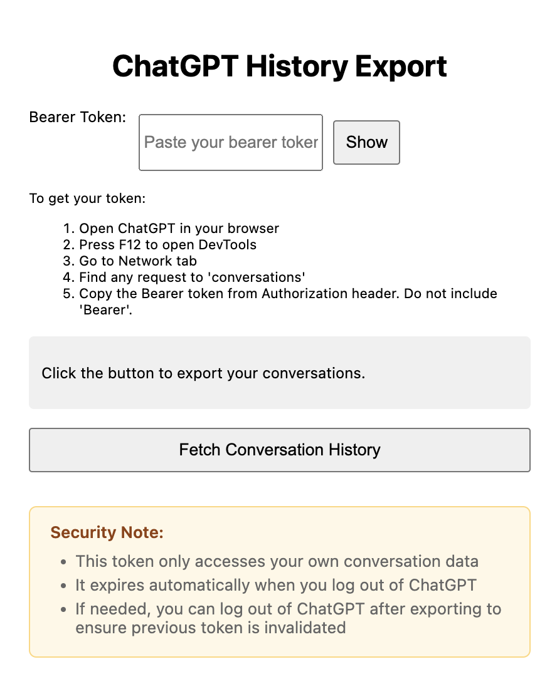
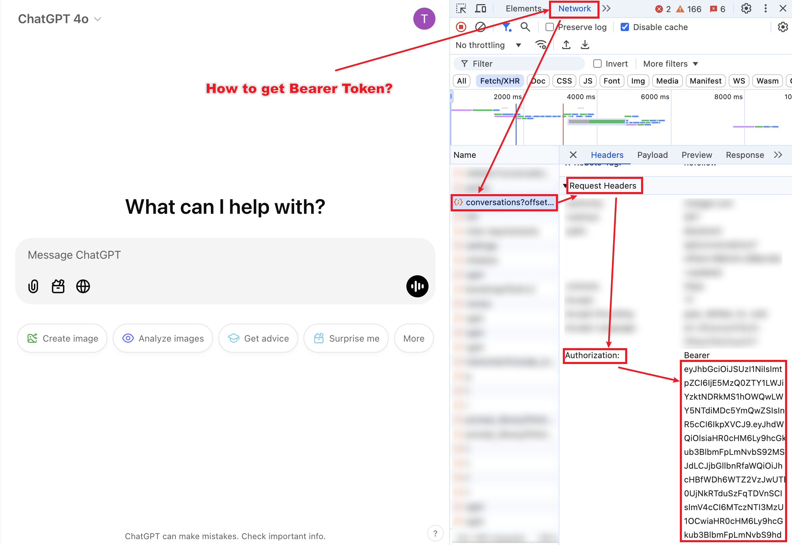

# chatgpt-heatmap

## 中文使用指引 (English Guides below)

### 如何使用

1. 在 Chrome 浏览器中打开 ChatGPT
2. 打开扩展程序
3. 输入您的 bearer token
4. 点击按钮导出您的对话记录
5. 等待数据获取完成 (可能需要几分钟，请勿关闭扩展程序)
6. 原始数据和处理后的数据将被获取并显示

### 安全提示

1. 这个 token 只能访问您的对话数据
2. 当您登出 ChatGPT 时，token 会自动过期
3. 如果需要，您可以在导出后登出 ChatGPT 以确保之前的 token 失效

### 如何获取bearer token

1. 在 Chrome 浏览器中打开 ChatGPT
2. 打开开发者工具
3. 切换到 Network（网络）标签页
4. 找到发送到`https://chatgpt.com/backend-api/conversations?xxx`的请求
5. 复制`Authorization`请求头的值，不要包含'Bearer'
6. 将其粘贴到扩展程序的输入框中

> 注意：如果您的 token 过期，您需要重新获取

### 如何清除数据

1. 点击清除数据按钮
2. 在弹出窗口中确认操作

### 如何下载数据

1. 点击下载数据按钮
2. 数据将以JSON文件格式下载

---

## English Guides

### How to use

1. Open ChatGPT in Chrome
2. Open the extension
3. Enter your bearer token
4. Click the button to export your conversations
5. Wait for the data to be fetched (It may take a few minutes, please do not close the extension)
6. The raw data and processed data will be fetched and displayed

### Security Note

1. This token only accesses your own conversation data
2. It expires automatically when you log out of ChatGPT
3. If needed, you can log out of ChatGPT after exporting to ensure previous token is invalidated

### How to get your bearer token

1. Open ChatGPT in Chrome
2. Open the developer tools
3. Go to the Network tab
4. Find the request to `https://chatgpt.com/backend-api/conversations?xxx`
5. Copy the value of the `Authorization` header. Do not include 'Bearer'.
6. Paste it into the extension's input field

> Note: If your token expires, you need to get it again

### How to clear data

1. Click the button to clear data
2. Confirm the action in the popup

### How to download data

1. Click the button to download data
2. The data will be downloaded as a JSON file